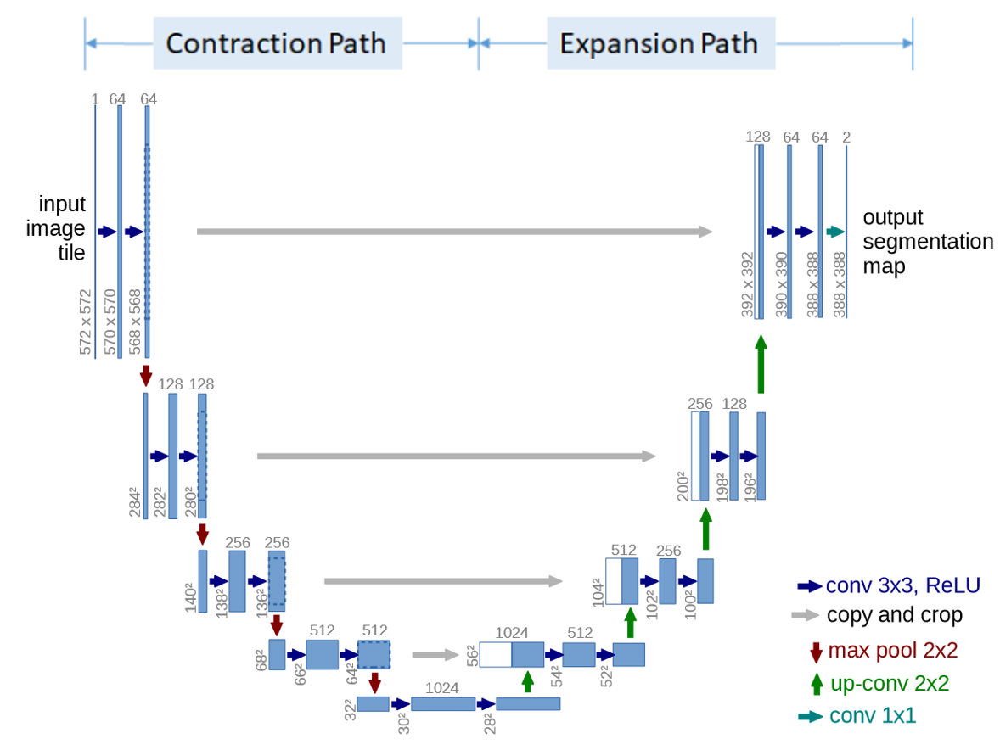

# unet-segmentation-in-pascal-voc-by-keras

## File description
Data_prepare .ipynb : \n
preparing_data_h5.ipynb: \n
model.py: \n
main.ipynb:
result_test.ipynb:

#### The original unet work architecture is 
{: width="100" height="100"}

#### We need to 21 classes classification so our revised architecture is 
{: width="200" height="200"}

#### I preprocessed pascal voc data along under picture
{: width="200" height="200"}

#### The test result is under picture left one is input right one is output
 
