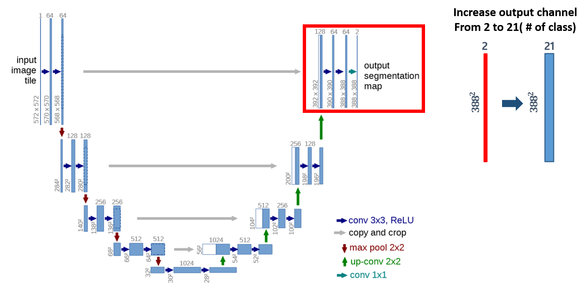
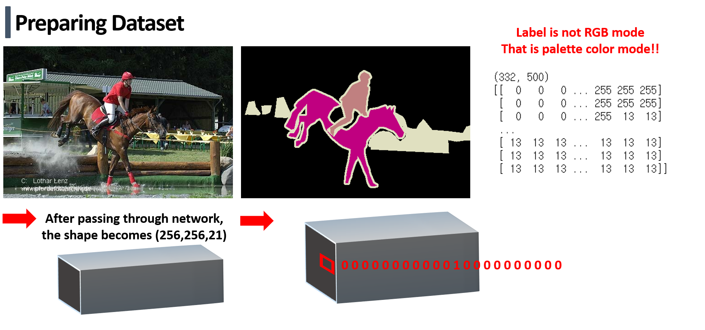
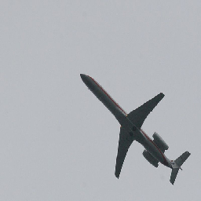
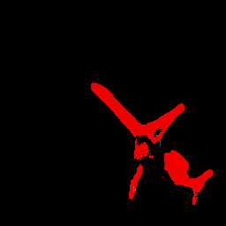

# unet-segmentation-in-pascal-voc-by-keras

## File description
Data_prepare .ipynb : With downloading VOCdevkit from http://host.robots.ox.ac.uk/pascal/VOC/voc2012/ execute this one
                      Then train and label data would be stored in "data" folder automatically.
                      it does also Flip_right_left data augmentation
                     

preparing_data_h5.ipynb: To process Big data, i stored images as h5 data format. To make whole matrix h5 format
                         execute this file

model.py: This one is unet model implemented by keras

main.ipynb:  train unet for image segmentation

result_test.ipynb: from "test" folder, read one image and pass it through trained network
                   the output form is 256x256x21 so by argmax make it 256x256. Then converting its form to 256x256x3 RGB mode
                   by determining what number is written in each row and colum. insert right RGB color

## Revised unet to classify 21 classes

## The test result is under picture left one is input right one is output
 

